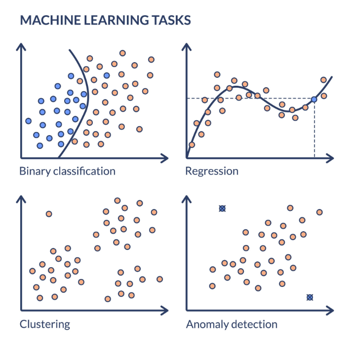

## Regression 
- It is a type of supervised learning algorithm 
- It is used when target variable is continuous and numeric 
- How much/How many?
- Fit a line/curve to a data points
- Common Algorithms: Linear Regression, Ridge Regression, Support Vector Regression (SVR).

## Classification
- It is also a type of supervised learning algorithm 
- Target variable are discrete and categorical  
- Which one is it? 
- Draw a boundary to separate data points 
- Common Algorithms: Logistic Regression (despite the name, it is a classification algorithm!), Decision Trees, Random Forests, Support Vector Machines (SVM). 

