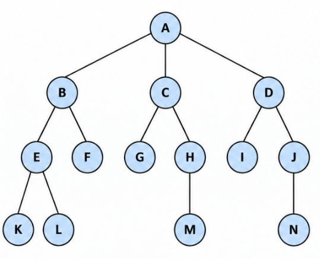

The key difference is:

> **BFS = Queue (FIFO)** → go level by level
> **DFS = Stack (LIFO)** → go as deep as possible

---

# 1. Our graph

We use:

```text
                 A
              /  |  \
             B   C   D
            / \ / \ / \
           E  F G  H I  J
          / \       |    |
         K   L      M    N
```

Start:

$$
A
$$

Goal:

$$
M
$$

Successors are considered **left → right**.

So:

```text
A → B, C, D
B → E, F
C → G, H
D → I, J
E → K, L
H → M
J → N
```

---

# 2. What does DFS maintain?

Just like BFS, we'll track:

### Frontier

Nodes waiting to be expanded.

But unlike BFS, DFS uses a:

$$
\boxed{\text{STACK}}
$$

A stack follows:

> **LIFO = Last In, First Out**

Think of a stack of plates:

```text
       TOP
        ↓
      ┌───┐
      │ B │  ← remove first
      ├───┤
      │ C │
      ├───┤
      │ D │
      └───┘
```

The **most recently added node is removed first**.

---

### Explored

Nodes already expanded:

```text
EXPLORED = { ... }
```

---

### Parent

We'll record:

```text
parent[B] = A
parent[E] = B
parent[K] = E
...
```

This lets us reconstruct the solution.

---

### Depth

Very useful for understanding DFS:

```text
A              depth 0
│
B              depth 1
│
E              depth 2
│
K              depth 3
```

DFS loves going down this path before considering siblings.

---

# 3. One VERY important detail about DFS

Suppose we're expanding A:

```text
A → B, C, D
```

We want DFS to visit **B first** because our specified successor order is:

> left → right

But a stack is LIFO.

Therefore, we need to put the successors onto the stack in **reverse order**:

```text
Push D
Push C
Push B
```

giving:

```text
TOP
 ↓
[B, C, D]
```

Then B is removed first.

### Exam trick ⭐

If successors are:

```text
B, C, D
```

and you want **left-to-right DFS**, remember:

$$
\boxed{\text{Push them right-to-left}}
$$

So:

```text
push D
push C
push B
```

This is a very common source of mistakes.

---

# 4. DFS initialization

Initially:

```text
FRONTIER = [A]

EXPLORED = {}
```

We'll write the frontier with the **top of the stack on the left**:

```text
FRONTIER = [TOP → ...]
```

---

# 5. Step 0 — Expand A

Current:

```text
FRONTIER = [A]
EXPLORED = {}
```

Remove A.

Is A the goal?

```text
A ≠ M
```

No.

Add A to explored:

```text
EXPLORED = {A}
```

A's children:

```text
B, C, D
```

To make DFS visit B first, push them in reverse:

```text
push D
push C
push B
```

Therefore:

```text
FRONTIER = [B, C, D]
EXPLORED = {A}
```

Parents:

```text
parent[B] = A
parent[C] = A
parent[D] = A
```

### State

| Step | Removed | Frontier (TOP first) | Explored |
| ---: | ------- | -------------------- | -------- |
|    0 | A       | **[B, C, D]**        | {A}      |

---

# 6. Step 1 — Expand B

Current:

```text
FRONTIER = [B, C, D]
```

Remove the **top**:

```text
B
```

Check:

```text
B ≠ M
```

Expand B.

Children:

```text
E, F
```

Again, we want E before F.

So push:

```text
F
E
```

Now:

```text
Before:

[B, C, D]

Remove B:

[C, D]

Push F:

[F, C, D]

Push E:

[E, F, C, D]
```

Therefore:

```text
FRONTIER = [E, F, C, D]

EXPLORED = {A, B}
```

Parents:

```text
parent[E] = B
parent[F] = B
```

### State

| Step | Removed | Frontier      | Explored |
| ---: | ------- | ------------- | -------- |
|    1 | B       | **[E,F,C,D]** | {A,B}    |

---

# 7. Step 2 — Expand E

Current:

```text
FRONTIER = [E, F, C, D]
```

Remove E.

```text
E ≠ M
```

Children:

```text
K, L
```

We want K first.

So push:

```text
L
K
```

Frontier becomes:

```text
[E, F, C, D]
       ↓
[F, C, D]
       ↓
[L, F, C, D]
       ↓
[K, L, F, C, D]
```

Therefore:

```text
FRONTIER = [K, L, F, C, D]

EXPLORED = {A, B, E}
```

Parents:

```text
parent[K] = E
parent[L] = E
```

### State

| Step | Removed | Frontier        | Explored |
| ---: | ------- | --------------- | -------- |
|    2 | E       | **[K,L,F,C,D]** | {A,B,E}  |

---

# 8. Step 3 — Expand K

Current:

```text
FRONTIER = [K, L, F, C, D]
```

Remove K.

K has no children.

So:

```text
FRONTIER = [L, F, C, D]

EXPLORED = {A, B, E, K}
```

### State

| Step | Removed | Frontier      | Explored  |
| ---: | ------- | ------------- | --------- |
|    3 | K       | **[L,F,C,D]** | {A,B,E,K} |

---

# 9. Step 4 — Expand L

Current:

```text
FRONTIER = [L, F, C, D]
```

Remove L.

L has no children.

Therefore:

```text
FRONTIER = [F, C, D]

EXPLORED = {A, B, E, K, L}
```

### State

| Step | Removed | Frontier    | Explored    |
| ---: | ------- | ----------- | ----------- |
|    4 | L       | **[F,C,D]** | {A,B,E,K,L} |

---

# 10. Step 5 — Expand F

Current:

```text
FRONTIER = [F, C, D]
```

F has no children.

So:

```text
FRONTIER = [C, D]

EXPLORED = {A, B, E, K, L, F}
```

### State

| Step | Removed | Frontier  | Explored      |
| ---: | ------- | --------- | ------------- |
|    5 | F       | **[C,D]** | {A,B,E,K,L,F} |

---

# 11. Now look at what just happened

DFS has completely explored the B branch:

```text
             A
            /
           B
          / \
         E   F
        / \
       K   L
```

The order was:

$$
\boxed{A \rightarrow B \rightarrow E \rightarrow K \rightarrow L \rightarrow F}
$$

Only **after exhausting that branch** does DFS return to C.

This is the fundamental behavior of DFS.

---

# 12. Step 6 — Expand C

Current:

```text
FRONTIER = [C, D]
```

Remove C.

Children:

```text
G, H
```

We want G first, so push:

```text
H
G
```

Therefore:

```text
FRONTIER = [G, H, D]

EXPLORED = {A, B, E, K, L, F, C}
```

Parents:

```text
parent[G] = C
parent[H] = C
```

### State

| Step | Removed | Frontier    | Explored        |
| ---: | ------- | ----------- | --------------- |
|    6 | C       | **[G,H,D]** | {A,B,C,E,F,K,L} |

---

# 13. Step 7 — Expand G

Current:

```text
FRONTIER = [G, H, D]
```

G has no children.

Therefore:

```text
FRONTIER = [H, D]

EXPLORED = {A,B,C,E,F,G,K,L}
```

---

# 14. Step 8 — Expand H

Now:

```text
FRONTIER = [H, D]
```

Remove H.

```text
H ≠ M
```

H has child:

```text
M
```

So:

```text
FRONTIER = [M, D]

EXPLORED = {A,B,C,E,F,G,H,K,L}
```

And:

```text
parent[M] = H
```

### State

| Step | Removed | Frontier  | Explored            |
| ---: | ------- | --------- | ------------------- |
|    8 | H       | **[M,D]** | {A,B,C,E,F,G,H,K,L} |

---

# 15. Step 9 — M!

Current:

```text
FRONTIER = [M, D]
```

Remove the top:

```text
M
```

Check:

$$
M = \text{Goal}
$$

🎯 **Success!**

DFS stops.

---

# 16. Final DFS path

We recorded:

```text
parent[M] = H
parent[H] = C
parent[C] = A
```

Work backward:

```text
M
↑
H
↑
C
↑
A
```

Reverse:

$$
\boxed{A \rightarrow C \rightarrow H \rightarrow M}
$$

Interestingly, **DFS and BFS found the same solution path on this particular graph**.

But they explored the graph in **very different orders**.

---

# 17. Complete DFS table

This is the table I'd recommend practicing for exams:

| Step | Node removed | New nodes | Frontier — TOP first | Explored            |
| ---: | ------------ | --------- | -------------------- | ------------------- |
|    0 | A            | B,C,D     | **[B,C,D]**          | {A}                 |
|    1 | B            | E,F       | **[E,F,C,D]**        | {A,B}               |
|    2 | E            | K,L       | **[K,L,F,C,D]**      | {A,B,E}             |
|    3 | K            | —         | **[L,F,C,D]**        | {A,B,E,K}           |
|    4 | L            | —         | **[F,C,D]**          | {A,B,E,K,L}         |
|    5 | F            | —         | **[C,D]**            | {A,B,E,K,L,F}       |
|    6 | C            | G,H       | **[G,H,D]**          | {A,B,E,K,L,F,C}     |
|    7 | G            | —         | **[H,D]**            | {A,B,E,K,L,F,C,G}   |
|    8 | H            | M         | **[M,D]**            | {A,B,E,K,L,F,C,G,H} |
|    9 | **M 🎯**     | —         | —                    | —                   |

So the **DFS expansion order** is:

$$
\boxed{A,\ B,\ E,\ K,\ L,\ F,\ C,\ G,\ H,\ M}
$$

while the solution is:

$$
\boxed{A\rightarrow C\rightarrow H\rightarrow M}
$$

---

# 18. Compare this with BFS

This is where the difference really becomes clear.

### BFS expansion order

$$
\boxed{A,B,C,D,E,F,G,H,I,J,K,L,M}
$$

### DFS expansion order

$$
\boxed{A,B,E,K,L,F,C,G,H,M}
$$

Same graph.

Same start.

Same goal.

Same successor ordering.

But **completely different exploration strategy**.

---

## BFS

BFS effectively does:

```text
              A
              ↓
          B   C   D
          ↓
       E  F G H I J
          ↓
       K  L M   N
```

It says:

> "Before I go deeper, let me finish this whole level."

---

## DFS

DFS does:

```text
A
↓
B
↓
E
↓
K
↑
L
↑
F
↑
C
↓
G
↑
H
↓
M 🎯
```

It says:

> "I'm going down this branch until I can't go any further."

That's the conceptual difference you want to remember.

---

# 19. The most important DFS exam rule

If you see:

```text
        A
      / | \
     B  C  D
```

and the question says:

> **DFS, successors left-to-right**

you should think:

```text
Desired visitation:
B → C → D

Stack operation:
push D
push C
push B

Stack:
[B, C, D]
 ↑
TOP
```

### Memorize:

$$
\boxed{\text{DFS + left-to-right → push right-to-left}}
$$

Because **LIFO reverses the insertion order**.

---

# 20. BFS vs DFS — exam cheat sheet

| Property               | BFS                                           | DFS           |
| ---------------------- | --------------------------------------------- | ------------- |
| Data structure         | Queue                                         | Stack         |
| Rule                   | FIFO                                          | LIFO          |
| Search style           | Broad                                         | Deep          |
| Goes level-by-level?   | ✅                                             | ❌             |
| Goes deep into branch? | ❌                                             | ✅             |
| Complete?              | ✅ under standard finite-branching assumptions | ❌ in general  |
| Optimal?               | ✅ when all step costs are equal               | ❌             |
| Memory                 | High                                          | Usually lower |
| Key value              | Depth                                         | Stack order   |

For the standard search results in Russell & Norvig, remember:

$$
\boxed{\text{BFS is complete and optimal for equal step costs}}
$$

whereas DFS is **not generally optimal** and is **not generally complete** in infinite-depth spaces.

---

# 21. One thing to be careful about in written exams

You may see slightly different presentations of DFS depending on whether the instructor writes the frontier as:

```text
[D, C, B]
```

or:

```text
[B, C, D]
```

That's usually just a question of **which end they call the "top" of the stack**.

Don't memorize the visual representation.

Memorize the actual rule:

> **The next node selected must be the most recently pushed node.**

And if the required successor order is left-to-right:

> **Push successors right-to-left.**

---

## Your mental model so far

You now have:

```text
BFS
 ↓
QUEUE
 ↓
FIFO
 ↓
oldest frontier node first
 ↓
level by level
```

and:

```text
DFS
 ↓
STACK
 ↓
LIFO
 ↓
newest frontier node first
 ↓
deepest available branch
```
